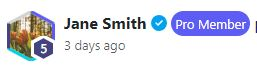
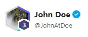

 
 
 
 


<br />
<h1>
<p align="center">
  <br>SocialMediaDemo
</h1>
  <p align="center">
    A WIP full-stack MERN Social Media App
    <br />
    </p>
</p>
<p align="center">
  <a href="#about-the-project">About The Project</a> •
  <a href="#usage">How To Use</a> •
  <a href="#video-demo">Video Demo</a> •
  <a href="#notes">Notes</a> •
  <a href="#features">Features</a> •
  <a href="#license">License</a>
</p>    

## About The Project
The purpose of this app is to display some of my experience and capabilities to use React, Typescript and Bootstrap. 

## Requirements
 - Need to have installed [Node/Npm](https://nodejs.org/en)

## Usage

1. Clone the repository:

```cmd
git clone https://github.com/RussellTrick/SocialMediaDemo.git
```

2. CD into client
```cmd
cd client
```

3. Install dependencies
```cmd
npm install
```

4. Run dev enviroment
```cmd
npm run dev
```

## Video Demo

## Notes
 - The full-stack part of this application is not yet developed but would involve the following:
   - Encrypted, hashed, salt and peppered passwords
   - http-only cookies to guard against XSS attacks
   - When calling the Posts API I would paginate the collection so that I can render only the newest posts in the client straight away allowing for better peformance
- All components adhere to SRP and are easily customisable with Modular SCSS.
- Usage of bootstraps grid system for a reponsive design
## Features
 - The UserCard component reactcs to a users level. The components border and value in the small hexagon corresponds to a users current level, it also takes optional props to display the Pro and Verified badges:  
     
   

 - The page is fully responsive and works on the screen sizes with appropriate styling for each

 - The LeftNavBar routing is properly set up to align with React taking advantages of Reacts DOM manipulation

 - Animated Loading bar and onHover/onClick Reactions emoji animations

## License
This work is licensed under a [Creative Commons Attribution-NonCommercial 4.0 International License](https://creativecommons.org/licenses/by-nc/4.0/).
